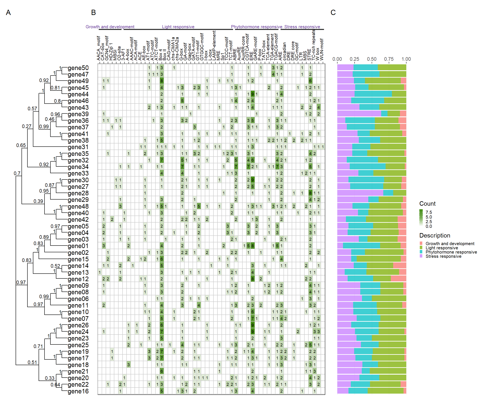

# BioVizSeq

## 1. Introduction

The goal of BioVizSeq is to visualize the types and distribution of
elements within bio-sequences. At the same time, We have developed a
geom layer, geom_rrect(), that can generate rounded rectangles. No
external references are used in the development of this package.

## 2. Installation

**Install from CRAN:**

[](https://cran.r-project.org/package=BioVizSeq)

``` r
# Install from CRAN
install.packages("BioVizSeq")
```

**Install from Github:** the development version of BioVizSeq:

``` r
install.packages("devtools")
devtools::install_github("zhaosq2022/BioVizSeq")
```

## 3. Libary packages

``` r
library(BioVizSeq)
#> Registered S3 methods overwritten by 'treeio':
#>   method              from    
#>   MRCA.phylo          tidytree
#>   MRCA.treedata       tidytree
#>   Nnode.treedata      tidytree
#>   Ntip.treedata       tidytree
#>   ancestor.phylo      tidytree
#>   ancestor.treedata   tidytree
#>   child.phylo         tidytree
#>   child.treedata      tidytree
#>   full_join.phylo     tidytree
#>   full_join.treedata  tidytree
#>   groupClade.phylo    tidytree
#>   groupClade.treedata tidytree
#>   groupOTU.phylo      tidytree
#>   groupOTU.treedata   tidytree
#>   inner_join.phylo    tidytree
#>   inner_join.treedata tidytree
#>   is.rooted.treedata  tidytree
#>   nodeid.phylo        tidytree
#>   nodeid.treedata     tidytree
#>   nodelab.phylo       tidytree
#>   nodelab.treedata    tidytree
#>   offspring.phylo     tidytree
#>   offspring.treedata  tidytree
#>   parent.phylo        tidytree
#>   parent.treedata     tidytree
#>   root.treedata       tidytree
#>   rootnode.phylo      tidytree
#>   sibling.phylo       tidytree
#> Package BioVizSeq loaded successfully!

# Extra package
library(ggplot2)
#> Warning: 程辑包'ggplot2'是用R版本4.3.3 来建造的
```

## 4. Usage cases

### 4.1 GFF/GTF

gff or gtf file

#### 4.1.1 Step by step

``` r
gff_path <- system.file("extdata", "idpro.gff3", package = "BioVizSeq")
gff_data <- read.table(gff_path, header = FALSE, sep = '\t')
gff_loc <- gff_to_loc(gff_data)

motif_plot(gff_loc$table_loc, gff_loc$gene_length) +
    labs(x="DNA length (5'-3')", y="Gene name")
```


#### 4.1.2 One step

``` r
gff_path <- system.file("extdata", "idpro.gff3", package = "BioVizSeq")
gff_plot(gff_path)
```


### 4.2 MEME

meme.xml or mast.xml

#### 4.2.1 Step by step

``` r
meme_path <- system.file("extdata", "meme.xml", package = "BioVizSeq") 
meme_file <- readLines(meme_path)
motif_loc <- meme_to_loc(meme_file)

motif_plot(motif_loc$table_loc, motif_loc$gene_length)
```


#### 4.2.2 One step

``` r
meme_path <- system.file("extdata", "meme.xml", package = "BioVizSeq")
meme_plot(meme_path)
```


### 4.3 PFAM

[PFAM](https://www.ebi.ac.uk/interpro/search/sequence/)

Download: .tsv

#### 4.3.1 Step by step

``` r
pfam_path <- system.file("extdata", "iprscan.tsv", package = "BioVizSeq")
pfam_file <- read.table(pfam_path, sep='\t', header = FALSE)
domain_loc <- pfam_to_loc(pfam_file)

motif_plot(domain_loc$table_loc, domain_loc$gene_length)
```


#### 4.3.2 One step

``` r
pfam_path <- system.file("extdata", "iprscan.tsv", package = "BioVizSeq")
pfam_plot(pfam_path)
```


### 4.4 CDD

[Batch
CD-Search](https://www.ncbi.nlm.nih.gov/Structure/bwrpsb/bwrpsb.cgi)

Download “Superfamily Only”

Type: .txt

#### 4.4.1 Step by step

``` r
hitdata_path <- system.file("extdata", "hitdata.txt", package = "BioVizSeq")
cdd_file <- readLines(hitdata_path)
domain_loc <- cdd_to_loc(cdd_file)

fa_path <- system.file("extdata", "idpep.fa", package = "BioVizSeq")
gene_length <- fastaleng(fa_path)
motif_plot(domain_loc, gene_length)
```


#### 4.4.2 One step

``` r
hitdata_path <- system.file("extdata", "hitdata.txt", package = "BioVizSeq")
fa_path <- system.file("extdata", "idpep.fa", package = "BioVizSeq")

cdd_plot(hitdata_path, fa_path)
```


### 4.5 SMART

protein file (.fa or .fasta)

#### 4.5.1 Step by step

``` r
fa_path <- system.file("extdata", "target.fa", package = "BioVizSeq")
domain_loc <- smart_to_loc(fa_path)
#> Submitting sequence AtAP2_002...
#> Submitting sequence AtAP2_003...
#> Job entered the queue with ID12315310532392161744375121WbaNoJFgcN. Waiting for results.
#> Submitting sequence AtAP2_004...
#> Submitting sequence AtAP2_005...

motif_plot(domain_loc$table_loc, domain_loc$gene_length)
```


#### 4.5.2 One step

``` r
fa_path <- system.file("extdata", "target.fa", package = "BioVizSeq")

smart_plot(fa_path)
#> Submitting sequence AtAP2_002...
#> Submitting sequence AtAP2_003...
#> Job entered the queue with ID12315310532400031744375151yYeUVQCXhb. Waiting for results.
#> Submitting sequence AtAP2_004...
#> Submitting sequence AtAP2_005...
```


### 4.6 Plantcare

promoter sequence(.fa or .fasta)

#### 4.6.1 Step by step

``` r
# 1. upload fasta file to plantcare, get the result file(.tab)
# upload_fa_to_plantcare(fasta_file, email)

# 2. Classify the functions of cis element

plantcare_path <- system.file("extdata", "plantCARE_output.tab", package = "BioVizSeq") 
plantcare_file <- read.table(plantcare_path, header = FALSE, sep = '\t', quote="")
plantcare_data <- plantcare_classify(plantcare_file)
plantcare_loc <- plantcare_to_loc(plantcare_data)

promoter_length <- data.frame(ID = unique(plantcare_loc$ID), length=2000)

motif_plot(plantcare_loc, promoter_length) +
    labs(x="Promoter Length", y="Gene")
```


#### 4.6.2 One step

``` r
plantcare_path <- system.file("extdata", "plantCARE_output.tab", package = "BioVizSeq") 
plantcare_plot(plantcare_path, promoter_length = 2000)
```


### 4.7 Advance Plot

p_tree, p_gff, p_pfam, p_meme, p_smart, p_cdd, p_plantcare

``` r
library(patchwork)
tree_path <- system.file("extdata", "idpep.nwk", package = "BioVizSeq")
gff_path <- system.file("extdata", "idpro.gff3", package = "BioVizSeq")
meme_path <- system.file("extdata", "meme.xml", package = "BioVizSeq")
pfam_path <- system.file("extdata", "iprscan.tsv", package = "BioVizSeq")
plot_file <- combi_p(tree_path = tree_path, gff_path = gff_path,
                     meme_path = meme_path, pfam_path = pfam_path)

plot_file$p_tree + plot_file$p_gff + plot_file$p_pfam +
  plot_file$p_meme +plot_layout(ncol = 4, guides = 'collect') +
  plot_annotation(
    tag_levels = 'A'
  )
```


``` r
library(patchwork)
tree_path <- system.file("extdata", "idpep.nwk", package = "BioVizSeq")
plantcare_path <- system.file("extdata", "plantCARE_output.tab", package = "BioVizSeq") 
plot_file <- combi_p(tree_path = tree_path, plantcare_path = plantcare_path, promoter_length = 2000)

plot_file$p_tree + plot_file$p_plantcare1 + plot_file$p_plantcare2 + plot_layout(ncol = 3, guides = 'collect', widths = c(1, 3, 1)) + plot_annotation( tag_levels = 'A' )
```


